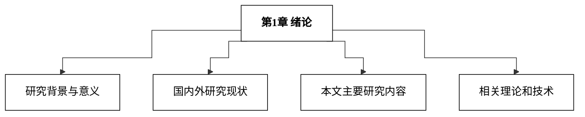

```mermaid
%%{init: {'flowchart': {'curve': 'step'}, 'themeVariables': {'fontFamily': '黑体, SimHei, sans-serif'}}}%%
flowchart TD
    classDef default fill:#FFFFFF,stroke:#000000,stroke-width:1px,color:#000000;
    
    A["<b>第1章 绪论</b>"] --> B["研究背景与意义"]
    A --> C["国内外研究现状"]
    A --> D["本文主要研究内容"]
    A --> E["相关理论和技术"]
```